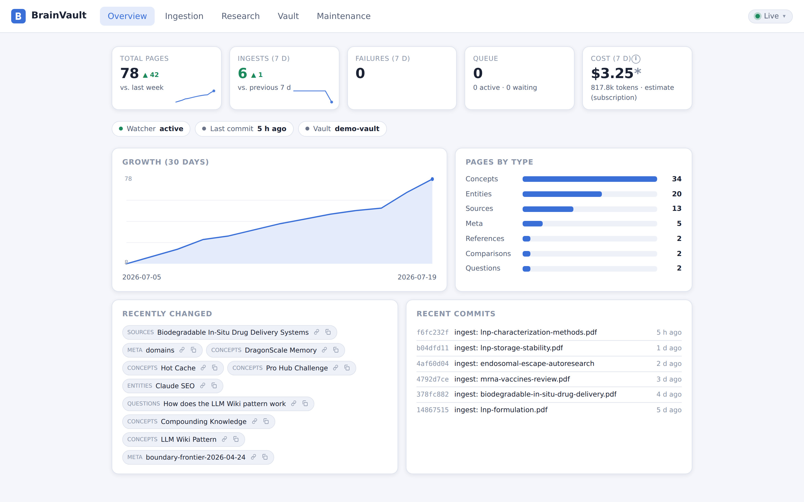
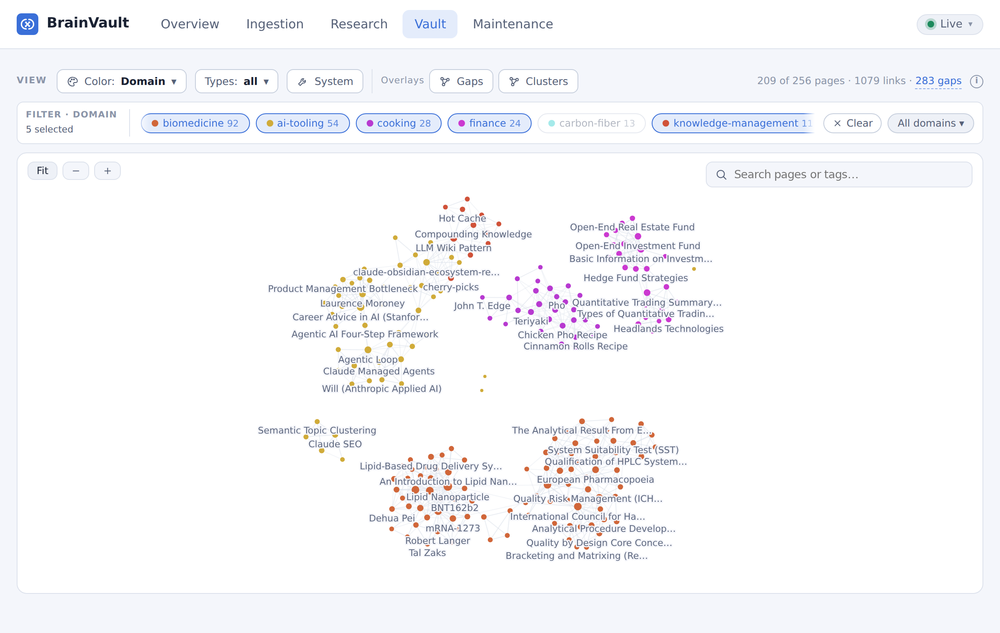

<p align="center">
  
</p>

# BrainVault

Drop a PDF into a folder - a few minutes later it is a set of linked, cited wiki pages in your
personal knowledge vault, written by an AI agent running entirely on your machine.

BrainVault is a local ingestion service and web dashboard on top of a
[claude-obsidian](https://github.com/AgriciDaniel/claude-obsidian) vault (v1.9.2, Generic mode).
It watches a folder, accepts drag-and-drop uploads and (optionally) files sent to a Telegram bot
from your phone, preprocesses the material (PDF, Office, web, images, text), and runs headless
Claude Agent SDK sessions that execute the vault's `ingest` skill fully automatically. A React dashboard exposes status, the job queue, research chat with citations,
an interactive vault viewer, and maintenance actions.





<sub>Screenshots from a demo vault (mRNA/lipid-nanoparticle literature plus this project's own
tooling notes); the ingest history behind the numbers is representative, not a benchmark.</sub>

Everything runs on your machine: the service binds `127.0.0.1` by default, the vault stays a plain
git repository on disk, and the only thing that leaves the box is the agent's traffic to Anthropic -
plus, if you enable the Telegram bot, its outbound polling of `api.telegram.org`.

> **`SPEC.md` (German) is the authoritative specification.** When code and spec disagree, the spec
> wins. The UI, code, and everything else are English. `CLAUDE.md` holds the hard rules that
> constrain any change. Per-milestone task lists and engineering findings live in `docs/tasks/`.

---

## Quick start (TL;DR)

**One command** (Linux, or Windows + WSL2 with Ubuntu):

```bash
git clone https://github.com/steinborndev/BrainVault.git && cd BrainVault
bash scripts/setup-all.sh
```

That installs everything (Node via nvm, sandbox + preprocessing toolchain, the vault,
the systemd service), starts the dashboard at <http://localhost:8420>, and leaves exactly
one step for the browser: the dashboard opens in **setup mode** and walks you through
connecting your Anthropic account (Claude subscription or API key) under
Maintenance → Settings.

**Windows without WSL yet:** download the repo and run `scripts\install.ps1` in
PowerShell - it installs WSL2 + Ubuntu, runs the setup above inside it, and puts a
BrainVault shortcut on your desktop.

**Manually instead:**

```bash
# 1. The vault this service writes into (lives OUTSIDE this repo)
git clone https://github.com/AgriciDaniel/claude-obsidian ~/vault
(cd ~/vault && bash bin/setup-vault.sh)

# 2. Sandbox + preprocessing toolchain
sudo apt-get install -y bubblewrap socat
./scripts/install-preprocessing-tools.sh

# 3. Build + run - then open http://127.0.0.1:8420 and add the credential in the UI
npm ci && npm run build
VAULT_ROOT=~/vault npm start
```

Each step is explained below; for an always-on setup see
[Autostart with systemd](#autostart-with-systemd-survives-a-wsl-restart).

---

## Requirements

| | |
|---|---|
| OS | Linux, or Windows + WSL2 (Ubuntu 24.04 is what this was built on) |
| Node | ≥ 20 LTS - via [nvm](https://github.com/nvm-sh/nvm): `. ~/.nvm/nvm.sh` |
| Vault | a claude-obsidian clone (v1.9.2, Generic mode), by default at `~/vault` |
| Credential | a Claude subscription token **or** an Anthropic API key (exactly one) - entered in the dashboard on first run, not needed to start |
| Claude Code CLI | only for the subscription path, to run `claude setup-token` once |
| Sandbox | `bubblewrap` + `socat` - **required**, agent runs fail without them |
| Preprocessing | poppler-utils, ocrmypdf, tesseract, pandoc, exiftool, defuddle, yt-dlp (YouTube URLs: metadata + subtitles) |

### 1. The vault

The vault lives **outside this repo** and its path is a configuration value - nothing hardcodes it.

```bash
git clone https://github.com/AgriciDaniel/claude-obsidian ~/vault
cd ~/vault && bash bin/setup-vault.sh
```

The service checks at startup that `VAULT_ROOT` contains `wiki/` and `skills/`, so pointing it at
the wrong directory fails immediately instead of at the first agent run.

### 2. Toolchain

```bash
sudo apt-get install -y bubblewrap socat        # sandbox - not optional, see "Security model"
./scripts/install-preprocessing-tools.sh        # poppler, ocrmypdf, tesseract, pandoc, …
```

### 3. Credential

**The easy path: none needed up front.** Without a credential the service starts in **setup
mode** - the dashboard shows a "Set up now" banner and collects the key under Maintenance →
Settings (choose Claude subscription or Anthropic API key), writes it into the service env
file, and restarts itself (under systemd). Everything below is the manual equivalent.

Exactly one credential may be configured - if both are set the service refuses to start, because
`ANTHROPIC_API_KEY` silently overrides the OAuth token and you would not know which one was billed.

```bash
mkdir -p ~/.config/vault-service
claude setup-token                              # subscription path (recommended)
printf 'CLAUDE_CODE_OAUTH_TOKEN=%s\n' "<token>" > ~/.config/vault-service/env
chmod 600 ~/.config/vault-service/env
```

The credential is read from that file (or the process environment) and is never written to the
repo, the database, the logs, or the API.

### 4. Install and build

```bash
. ~/.nvm/nvm.sh
npm ci
npm run build            # web/dist (SPA) + server/dist (runnable JS)
```

---

## Running it

```bash
VAULT_ROOT=~/vault npm start          # tsx, from source - the everyday dev command
```

Then open <http://127.0.0.1:8420>. `VAULT_ROOT` is deliberately **not** in the credential file;
pass it explicitly.

**With hot reload** (two terminals):

```bash
npm run dev:web                       # Vite dev server, proxies /api
VAULT_ROOT=~/vault npm run dev:server
```

**Production-style** (the built JS, one process - this is what systemd runs):

```bash
npm run build && VAULT_ROOT=~/vault npm run start:prod
```

### Autostart with systemd (survives a WSL restart)

```bash
./scripts/install-systemd.sh ~/vault    # writes + enables the user unit
loginctl enable-linger "$USER"          # so it runs without an active login
systemctl --user start vault-service
```

Check it, and watch the logs:

```bash
systemctl --user status vault-service
curl -s http://127.0.0.1:8420/api/v1/health
journalctl --user -u vault-service -f
```

The unit runs the **built JS as a single `node` process**, not `tsx` or `npm`, so systemd's main
PID is the server itself. A wrapper would leave an orphaned node child holding port 8420 after a
stop. `KillMode=control-group` additionally reaps any in-flight agent run's descendants with the
service. After changing code, `npm run build` and `systemctl --user restart vault-service`.

**Verifying the restart survives a reboot:** in Windows run `wsl --shutdown`, reopen WSL, then
`curl http://127.0.0.1:8420/api/v1/health` - it must answer without any manual start. On restart,
`queued` jobs resume automatically; jobs that were mid-flight when the service stopped are marked
`failed` with an "interrupted by a service restart" reason and are one-click retryable. They are
deliberately *not* replayed automatically: an interrupted ingest may have partially written the
vault, and silently replaying a mid-commit write risks vault integrity.

---

## The dashboard

Five tabs, all live over SSE:

- **Overview** - page counts by type, wiki growth, recently changed pages and recent commits, the
  hot cache, 7-day KPIs with week-over-week trends, token/cost totals and the daily budget.
- **Ingestion** - dropzone (files + URLs), active jobs with a live agent log, the queue, and a
  filterable history with created pages, duration, tokens and cost per job.
- **Research** - chat against the read-only query runner; answers cite vault pages as clickable
  chips that both deep-link into Obsidian and expand an inline preview of the page. Multiple named
  sessions, each savable into the vault as a page ("Save to vault"). Autoresearch runs live here
  too.
- **Vault** - the viewer that makes the Obsidian app optional for everyday use: an
  interactive graph of the wikilink structure (search over titles **and** frontmatter tags,
  per-bucket **and per-domain** filters - nodes can be colored by wiki type or by their
  frontmatter `domain:` meta-category - and a local-
  neighborhood mode around a focused page) and a page view with rendered markdown, clickable
  `[[wikilinks]]`, a frontmatter properties panel, and backlink/outgoing panels. Pages can be
  **edited and deleted right here** - every mutation is one git commit (`edit:`/`delete:`),
  serialized behind the same commit mutex as agent commits, with an optimistic lock (409 if an
  agent changed the page since you loaded it). After a delete, a banner counts the backlinks
  that just went dangling and points you at a lint run. Deep-linkable: `/vault` and
  `/vault/page/<path>` survive a reload and browser back/forward.

  All page links across the dashboard open this viewer first; the `obsidian://` deep link is
  the secondary action on each chip. That makes the dashboard fully usable from a **Windows**
  browser - Windows-Obsidian cannot open a WSL vault over `\\wsl$`, so the deep links only
  work from a WSLg browser.
- **Maintenance** - lint (structured report), hot-cache refresh with its last-refresh time, the
  domain registry with its backfill action, and the settings editor.

**Domains** are the vault's meta-categories (`biomedicine`, `ai-tooling`, `knowledge-management`,
…), the axis the graph filters and colors by. The allowed list lives in the vault itself, as the editable
page `wiki/meta/domains.md` - install the seed with `scripts/install-domain-registry.sh`. Every
vault-writing agent run gets that list as a **closed** set: it files each page under one key, or
under `unassigned` when nothing fits, and may never coin a new key. New domains are created by a
human editing that page (or accepting a candidate in the Maintenance tab); the rule of thumb is
that five or more coherent `unassigned` pages are what justifies one. `Maintenance → Domains → Backfill` files existing pages retroactively
(frontmatter only - it never touches page bodies).

The Maintenance tab also runs the **governance loop**: it continuously (and for free) looks for
themes among the `unassigned` pages that are big enough to deserve a domain, and shows them as
candidates with their page list and a link-cohesion score. Accepting one appends it to the
registry as a single commit; rejecting one is remembered so it stops being proposed. A toggle
adds an optional agent pass that judges each candidate - new domain, belongs to an existing one,
or not a real theme - and pre-fills the proposal. That pass is read-only: only you create
domains.

The graph renders on a canvas with the force layout in a web worker, so it stays smooth as the
vault grows - deliberately, since the WSLg Obsidian graph does not. It also updates **live**:
while an ingest writes pages, a debounced `vault` SSE event refreshes the graph, new nodes
surface at their neighbors' centroid with a brief flash, existing nodes keep their positions,
and the camera never jumps. The vault itself is never
written from here; only agent runs write (see the security model).

## Configuration

Two layers, with one deliberate precedence rule:

```
env / ~/.config/vault-service/env   →  start-time BASELINE
settings table (Maintenance tab)    →  runtime OVERRIDES
effective value                     =  override ?? baseline
```

Clearing an override (the "Reset" button) falls back to the baseline. Overrides live in
SQLite and survive a restart.

| Variable | Default | Notes |
|---|---|---|
| `VAULT_ROOT` | - | **required**; validated at startup |
| `HOST` | `127.0.0.1` | see the bind rule below |
| `PORT` | `8420` | |
| `WATCH_FOLDER` | `/mnt/c/inbox` | the default targets a Windows mount - on plain Linux, point it at a real folder; also settable at runtime (restart required) |
| `MAX_UPLOAD_BYTES` | 200 MB | also settable at runtime (restart required) |
| `HTTP_AUTH_MODE` | `local-single-user` | `token` enables bearer auth |
| `HTTP_AUTH_TOKEN` | - | required for a non-loopback bind |
| `WATCH_POLLING` | auto | forced on for `/mnt/*` (Windows mounts have no inotify) |
| `OBSIDIAN_VAULT_NAME` | vault dir name | for `obsidian://` deep links |
| `TELEGRAM_BOT_TOKEN` | - | enables the Telegram bot (see below); a secret, same handling as the credential |
| `TELEGRAM_ALLOWED_USER_IDS` | - | comma-separated numeric Telegram user ids; **required** once the token is set |
| `DB_PATH` | `~/.local/share/vault-service/jobs.db` | kept **outside** the vault |

Runtime-settable in the Maintenance tab: watch folder, concurrency, upload limit, git auto-commit,
and the daily budget. Concurrency and auto-commit apply live; the watch folder and upload limit are
bound at startup and are flagged "Restart required" rather than pretending they took effect.

The bind address is **not** settable through the UI, by design. The credential is settable -
but only through the dedicated guarded endpoint that writes the env file (setup mode /
"Replace credential"), never through the settings table, and it is never displayed or stored
anywhere else.

### Daily budget

Optional. The unit follows the auth mode, because the two modes constrain different things:

- **Subscription (oauth):** a **job count per day**. There is no per-run charge; runs compete with
  your interactive Claude usage for the same limits.
- **API key:** a **USD amount per day**.

When the budget is reached the queue stops claiming new work (in-flight runs always finish) and
resumes at the next local midnight. In subscription mode every `cost_usd` shown in the UI is
labelled **"estimate (subscription)"** - it is an API-price equivalent, not money charged.

---

## Telegram bot (optional)

A phone-first input channel (SPEC.md §4.3): send the bot a PDF, a photo, a URL or a plain-text
note and it lands in the regular ingestion queue; when the ingest finishes, the bot reports back
with the created page titles. `/status` answers with queue, job and budget state, `/jobs` lists
recent jobs.

The transport is **outbound long polling** - the service calls `api.telegram.org`, nothing calls
the service. No port is opened, the localhost bind stays untouched, and it works from anywhere
your phone has internet, without Tailscale or a reverse proxy.

Setup:

1. **Create a bot:** talk to [@BotFather](https://t.me/BotFather) in Telegram, send `/newbot`,
   pick a name and username. BotFather answers with the bot token.
2. **Find your numeric user id:** message a bot like `@userinfobot`, which replies with your id.
   (Usernames don't work here - they are mutable and spoofable; the allowlist wants the number.)
3. **Configure** - either in the dashboard under **Maintenance → Settings → "Set up Telegram
   bot…"** (writes the env file for you and restarts the service under systemd), or by editing
   `~/.config/vault-service/env` directly:

   ```bash
   TELEGRAM_BOT_TOKEN=123456789:AAF...
   TELEGRAM_ALLOWED_USER_IDS=111111111        # comma-separated for several people
   ```

4. **Restart** (only needed after editing the file by hand):
   `systemctl --user restart vault-service`, then send the bot `/status`.

Behavior and limits:

- **Allowlist, fail-closed.** A token without `TELEGRAM_ALLOWED_USER_IDS` refuses startup.
  Messages from ids outside the list get **no answer at all** - by design, a reply would
  confirm the bot exists, and every accepted message can start a paid agent run.
- **Files up to 20 MB.** Telegram lets bots download at most 20 MB (senders may attach up to
  2 GB); larger files get a hint pointing at the dropzone or the watch folder.
- **Albums become one batch.** Files sent together as an album are ingested in a single
  combined run, like a multi-file drop in the dashboard.
- **Notifications carry titles only.** The completion message names the created wiki pages,
  never their content - vault content does not transit Telegram's cloud. (The file you *send*
  does, like any Telegram upload; that is your call as the sender.)
- **Exactly one poller per token.** Telegram allows a single `getUpdates` consumer; if a second
  instance polls the same token (typically a dev run next to the systemd service), the bot logs
  the conflict and stops - the service itself keeps running.
- **Setup mode:** `/status` answers (and says so); ingests are refused with guidance until a
  credential is configured.
- **Disabling:** Maintenance → Settings → "Disable" removes both variables from the env file
  (and restarts the service under systemd); the token itself is never displayed anywhere after
  saving - revoke it via BotFather if it may have leaked.

---

## Security model

Four constraints are load-bearing. They are documented in full in `CLAUDE.md`; do not weaken them.
`SECURITY.md` has the full threat model - including what a malicious *document* can and cannot make
the ingest agent do - and the vulnerability reporting channel.

1. **Vault integrity.** The service writes to the vault only through agent runs and git commits.
   SQLite holds operational state only - losing the database must never damage the vault.
2. **Localhost guard.** The server binds `127.0.0.1`. If the bind is not loopback and no auth mode
   with a token is active, it **refuses to start**. State-changing requests carrying a foreign
   browser `Origin` are rejected, so a malicious website cannot fire drive-by requests at the
   loopback port.
3. **Credentials** live only in the service environment - never in the repo, logs, frontend or
   database. Both credential variables set at once is a startup error.
4. **Agent confinement is enforced by the OS sandbox**, not by application-level callbacks. Runs
   execute under bubblewrap with writes confined to `VAULT_ROOT` and no web egress except in the
   autoresearch flow. Tool policy additionally runs through a `PreToolUse` hook. `canUseTool` was
   measured to be invoked *zero* times by this SDK and is not the enforcement point.

Because the sandbox is the real boundary, it is configured with `failIfUnavailable: true`: if
bubblewrap is missing or cannot start, an agent run **fails loudly** instead of silently running
unconfined. That is why `bubblewrap` and `socat` are hard requirements.

A stuck agent run cannot outlive its timeout either: the runner owns the CLI spawn, puts it in its
own process group, and escalates a timeout to a group `SIGKILL` - otherwise an aborted run leaves
its `bash`/`python3` descendants running, which is what once made a lint outlive its 15-minute
timeout by six minutes.

Both guarantees rest on SDK behaviour that unit tests structurally cannot observe, so each has a
live probe. Re-run them after any change to the permission/spawn wiring or an SDK upgrade:

```bash
# Is our guard still consulted at all? Expects: canary outside vault: blocked
VAULT_ROOT=~/vault npm run permprobe --workspace server

# Does a stuck tool really die with the run? Expects: PASS … descendants were reaped
# Point this at a THROWAWAY vault - it runs write-enabled (see the script header).
VAULT_ROOT=/tmp/throwaway-vault npm run killprobe --workspace server
```

---

## Docker

The image exists so the service can move to an always-on Linux host later (SPEC.md §12.2); under
WSL the systemd unit above is the day-to-day path.

```bash
docker build -t brainvault .
docker run --rm \
  -v ~/vault:/vault -v brainvault-data:/data -v ~/inbox:/inbox \
  -e CLAUDE_CODE_OAUTH_TOKEN=... \
  --security-opt seccomp=unconfined \
  -p 127.0.0.1:8420:8420 \
  -e HOST=0.0.0.0 -e HTTP_AUTH_MODE=token -e HTTP_AUTH_TOKEN=<secret> \
  brainvault
```

Verified on Docker Desktop 4.52 / Engine 29.0.1 (linux/amd64): the image builds, ships bubblewrap
+ socat and the full preprocessing toolchain, `better-sqlite3` loads across the build/runtime
stage boundary, and the service starts as PID 1 and serves both the API and the SPA.

Four things to know:

- **Publishing the port requires a token.** The localhost guard is not relaxed inside a container:
  to reach the service from outside you must set `HOST=0.0.0.0` **and** `HTTP_AUTH_MODE=token` +
  `HTTP_AUTH_TOKEN`, otherwise the service refuses to start (verified - it exits with a
  configuration error). Without them the container serves only on its own loopback.
- **Pass the credential as an environment variable here.** The dashboard's first-run setup flow
  needs browser access, which token mode (below) denies - so in a container the credential comes
  from `-e CLAUDE_CODE_OAUTH_TOKEN=…` (or `-e ANTHROPIC_API_KEY=…`), as in the example above.
- **In token mode the browser UI is not reachable, only the API.** The auth middleware protects
  everything except `/api/v1/health`, including the SPA itself, so a browser gets a `401` before it
  can load the page that would ask for a token. `curl -H "Authorization: Bearer <token>"` works
  fine. A login screen is explicitly future work (SPEC.md §12.1, the auth "Ausbaustufe"); until it
  exists, use the container for API/headless operation and the systemd path for browser use.
  (`--network host` would sidestep this on a native Linux daemon by binding the host loopback
  directly, but under Docker Desktop the container joins the Docker VM's network namespace instead,
  so it does not help here - measured.)
- **bubblewrap needs unprivileged user namespaces.** Depending on the host and daemon configuration
  the container may need `--security-opt seccomp=unconfined` (as above) or, on restrictive hosts,
  `--cap-add SYS_ADMIN`. If the sandbox cannot start, agent runs fail with a clear error - by
  design - so a failing ingest with a sandbox message means this, not a broken vault.

**Bind-mounting your real vault:** the container runs as uid 10001, so a bind-mounted host
directory owned by your user is readable but not writable by agent runs. Pass
`--user "$(id -u):$(id -g)"` when you need the container to write into a host-mounted vault.

---

## Development

```bash
npm test                 # server unit tests (vitest) - agent runs are mocked
npm run typecheck        # server + web
npm run lint             # server (eslint)
```

Layout:

```
server/   Fastify backend, TypeScript ESM
  src/api/        routes under /api/v1, auth middleware
  src/pipeline/   watcher, queue, preprocessing plugins, agent runner, permissions
  src/db/         better-sqlite3 schema + migrations
web/      React + Vite frontend (responsive, PWA-ready)
scripts/  setup helpers, systemd unit template
docs/     per-milestone task lists and findings
```

Conventions: TypeScript strict, ESM, conventional commits. Pipeline logic (queue transitions,
dedupe, preprocessing, guards) gets unit tests; agent runs are mocked. New source types are added
as preprocessing plugins, never as special cases in the pipeline core. `npm test` must pass before
a milestone is called done.

## API

All endpoints are under `/api/v1` and behind the auth middleware (v1 mode `local-single-user` is
pass-through). `GET /api/v1/health` is public so a supervisor can probe it. State-changing requests
carrying a foreign browser `Origin` are rejected with a `403` - a website you visit cannot drive
the service behind your back. In **setup mode** (no credential yet) everything that would start an
agent run answers `503` until the credential is entered.

```
POST   /jobs                     upload / URL / pasted text (multi → batch)
GET    /jobs, /jobs/:id          list + detail
POST   /jobs/:id/retry           retry a failed or deferred job
DELETE /jobs/:id, /jobs          cancel; clear history
GET    /events                   SSE: job updates, log streams, stats + vault invalidation
GET    /stats                    dashboard numbers, usage totals, budget
POST   /query                    read-only question against the vault (+ citations)
GET/POST/PATCH/DELETE /sessions  chat sessions
POST   /sessions/:id/save        save a chat session into the vault (async run)
GET    /pages?path=…[&full=1]    one wiki page's markdown - truncated preview, or the full
                                 page + title/type/mtime with full=1
PUT    /pages                    user edit {path, markdown, baseMtime} → write + git commit
                                 (409 when the page changed since baseMtime)
DELETE /pages?path=…             user delete → unlink + git commit; returns staleLinks
                                 (backlinks that now dangle, drives the lint banner)
GET    /graph                    the vault's wikilink graph: typed nodes + directed edges
GET    /domains                  the vault's domain registry (installed? + parsed entries)
POST   /domains                  create a domain: append to the registry page, one commit
GET    /domains/candidates       themes among `unassigned` pages worth a domain (free)
POST   /domains/candidates/:key/dismiss     stop proposing this theme (DELETE undoes it)
POST   /maintenance/{lint,research,hot-cache,domain-backfill,domain-review}
                                 starts an async run → { id, channel }; backfill 409s
                                 without an installed registry, review 409s with no candidates
GET    /maintenance/runs         recent runs
GET    /maintenance/runs/:id     poll one run's result
GET/PUT /settings                runtime configuration
POST   /settings/credential      first-run onboarding: {kind: oauth|api-key, value} → writes
                                 the service env file (0600) and restarts; never echoes the
                                 value, 409 if the credential comes from the process env or
                                 runs are in flight
```

Every vault-mutating agent run (lint, autoresearch, hot-cache, and saving a chat session) is
asynchronous: the POST returns a run id immediately and streams its live log over the SSE channel,
then you poll `/maintenance/runs/:id`. A long lint can never wedge the HTTP request.

`GET /pages` is deliberately narrow: the path comes from agent-produced citations (and from
client-side routes), so it is confined to `VAULT_ROOT/wiki`, must end in `.md`, and is re-checked
after `realpath` so a symlink cannot become a read primitive.

`GET /graph` derives everything from the filesystem and caches parses per file on (mtime, size),
returning the previous graph unchanged when nothing moved - a repeat request on the real vault
costs about 2 ms.

## Troubleshooting

**Frontend changes don't show up after a rebuild.** The static file routes are registered at
startup (`@fastify/static` with `wildcard: false`), so a running service keeps serving the old
asset names and the new hashed files fall through to the SPA shell. Restart the service after
`npm run build:web` (`systemctl --user restart vault-service`).

**Port 8420 already in use.** Usually an orphaned process from a killed `tsx`/`npm` wrapper:
`ss -ltnp | grep 8420`, then kill the PID. The systemd unit avoids this by running the built JS
directly.

**Agent runs fail with a sandbox error.** `bubblewrap` or `socat` is missing, or user namespaces
are unavailable (common in containers). This is the sandbox refusing to run unconfined - install
the packages rather than disabling the sandbox.

**Runs fail with "zero tokens" / "Not logged in".** The credential did not reach the subprocess.
Check `~/.config/vault-service/env` and that only one credential variable is set.

**Everything answers 503 and a "Set up now" banner is showing.** That is setup mode: no credential
is configured, so nothing that would spawn an agent is allowed to run. Add it under
Maintenance → Settings; the service restarts itself and picks up any queued work.

**The watch folder never fires.** Windows mounts (`/mnt/*`) deliver no inotify events; the watcher
switches to polling automatically. Force it with `WATCH_POLLING=true`.

**A page the agent wrote is missing from the commit / `git status` shows an untracked page.**
The commit pathspec is derived from the agent's `Write`/`Edit` tool calls. A page it creates or
renames with `Bash` is invisible to that; the run sweeps such pages in automatically, but only
while it can prove it was the sole vault writer - with a second run in flight the sweep is skipped
rather than risk filing the page under the wrong job. Commit it by hand; nothing is lost.

**The Telegram bot went silent.** Check the service log: `getUpdates conflict (409)` means a
second process polled the same bot token (usually a dev instance next to the systemd service) -
the bot stops permanently until a restart; `401 Unauthorized` means the token is wrong or was
revoked in BotFather. Both stop only the bot, never the service. Also remember the fail-closed
rule: a token **without** `TELEGRAM_ALLOWED_USER_IDS` refuses startup, and senders outside the
allowlist get no reaction whatsoever - that silence is the guard working, not a bug.

**Obsidian cannot open the vault over `\\wsl$`.** It can't - Obsidian for Windows fails with
`EISDIR … watch`. Run Obsidian inside WSL via WSLg instead; the vault stays on ext4. (The Vault
tab exists precisely so that everyday reading/editing does not need Obsidian at all.)

---

## Status & license

A personal project (v0.1) built milestone by milestone with Claude Code; the engineering journals
in `docs/tasks/` are left in as-is - findings, dead ends, measurements and all. The specification
(`SPEC.md`) is German; code, UI, and vault content are English. Issues and PRs are welcome, with
the caveat that `SPEC.md` and the hard rules in `CLAUDE.md` define what this is and is not.

[MIT](LICENSE) © Benjamin Steinborn
